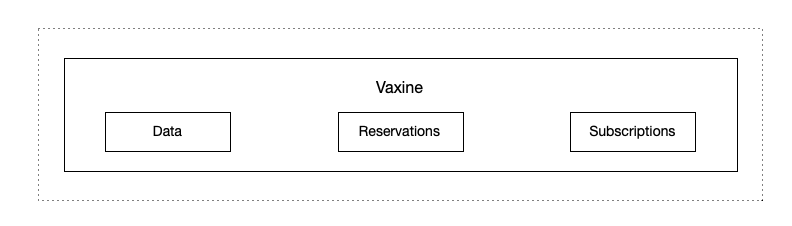

# Vaxine
Welcome to the Vaxine repository!

Vaxine provides rich-CRDT features on top of Antidote [Antidote](https://github.com/AntidoteDB/antidote).

Vaxine extends Antidote with a relational-oriented data-model, the ability to maintain invariants, a query language and real-time subscriptions service. Vaxine enables developers to create applications that are scalable and maintain consistency, without making the typical availability sacrifices of CP systems. 

Applications built on top of Vaxine offer:

* Geo-distributed deployments
* Multi-writer, low-latency writes
* Integrity constraints
* Real-time update subscriptions


## Vaxine architecture



Vaxine is divided in three main components:

- [Data:](https://github.com/vaxine-io/vaxine/blob/main/design/data.md) we provide a relational data-model with expressive querying capabilities.
- [Reservations:](https://github.com/vaxine-io/vaxine/blob/main/design/reservations.md) Provides concurrency control mechanisms that can ensure data integrity with high availability. 
- [Subscriptions:](https://github.com/vaxine-io/vaxine/blob/main/design/subscriptions.md) Stream replication changes with ordering guarantees, persistence and efficient payload propagation.


Stay tuned as we improve this document with more details and instructions to install and deploy Vaxine.

## Installation

If [available in Hex](https://hex.pm/docs/publish), the package can be installed
by adding `vaxine` to your list of dependencies in `mix.exs`:

```elixir
def deps do
  [
    {:vaxine, "~> 0.1.0"}
  ]
end
```

Documentation can be generated with [ExDoc](https://github.com/elixir-lang/ex_doc)
and published on [HexDocs](https://hexdocs.pm). Once published, the docs can
be found at <https://hexdocs.pm/vaxine>.
